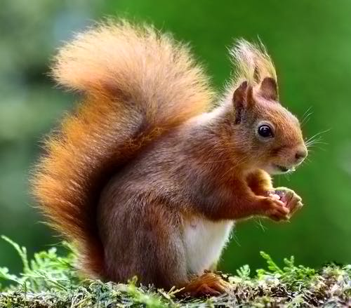
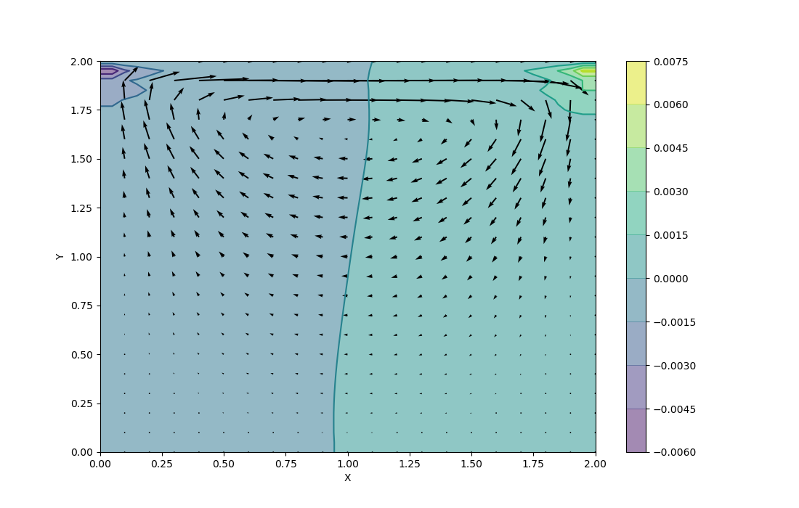

# __Final DSP Project__

## _Group members_

1. ### Hendwan Alhussein Abozide
2. ### Rawda Ahmed Romaih
3. ### Rokaya Mohamed ElNagar
4. ### Tasneem Adel

## _Problem 1_

## _Problem 2_

1. ### Click on Decode button to browse for an Image
2. ### Select the image 

### **_Results_**

* ### **8** progressively decoded pictures will show up; 4 in the **first tab** and 4 in the **second tab**.

* ### _Sample Images_:

   #### Third Picture

   

   #### Eighth Picture
  
   

## _Problem 3_

1. ### Click on the Piano buttons in the **first tab** to hear different sounds.

2. ### Click on the Pan flute buttons in the **second tab** to hear different sounds.

## _Problem 5_

### **Point B :**

* ### We managed to simulate the Navier Stokes equation of the cough in the **sagital plane**  ( looking at the patient's mouth from the side)

* ### Parameter used:
   * ### Average denisty of vapour in the cough : 0.001 mg/m^3 
   * ### Average Speed of cough: 1.87 m/sec

### _Sample Image_:

* ### The mouth is located at 23:00 (top left corner)

  

